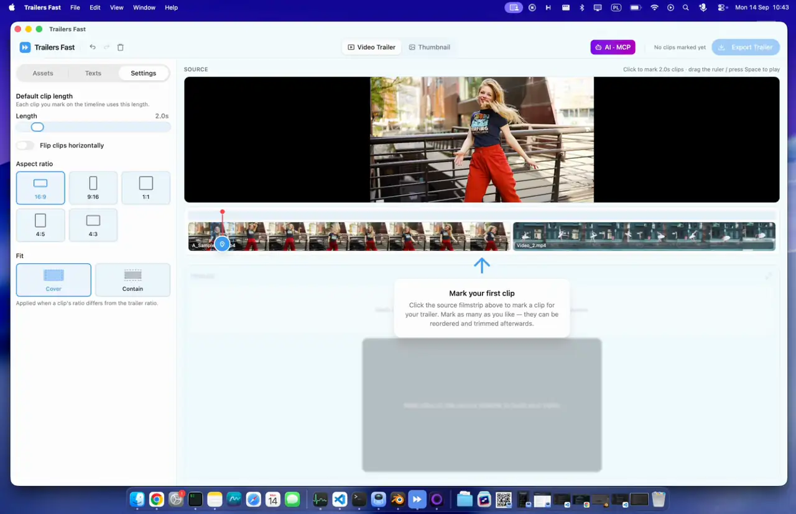

<p align="center">
  
</p>
<h1 align="center">Trailers Fast</h1>

<p align="center">
  <strong>The fastest way to create a trailer from your longer videos: AI edits supported, single-click editing, preview before rendering.</strong><br>
  Drop your footage in, click the moments you want, export. Three steps, no timeline wrangling.<br>
  Full AI agent support over MCP.
</p>

<p align="center">
  <a href="https://github.com/paulwalczewski/trailersfast/actions/workflows/ci.yml"></a>
  <a href="https://github.com/paulwalczewski/trailersfast/releases/latest"></a>
  <a href="LICENSE"></a>
  
  <a href="https://v2.tauri.app"></a>
  <a href="https://modelcontextprotocol.io"></a>
  
  <a href="#contributing"></a>
</p>

Desktop app for macOS and Linux. Tauri v2 (Rust) · React 19 · Remotion Player for preview · bundled FFmpeg for export. Nothing leaves your machine.

<p align="center">
  
</p>

## Download

**Mac (Apple Silicon):** [download the DMG](https://github.com/paulwalczewski/trailersfast/releases/latest/download/TrailersFast-aarch64.dmg), open it, drag Trailers Fast to Applications.

Intel Mac, Linux, or hooking up an AI agent: see [Getting started](#getting-started).

## Why it's fast

In DaVinci Resolve or Premiere you *build* a trailer: import, scrub, set in and out points, trim, arrange on a timeline. In Trailers Fast you *point at* one: a single click on the filmstrip, and that moment is a clip.

1. **Drop videos** onto the Assets panel. They line up end-to-end on one source filmstrip.
2. **Click the filmstrip** wherever something good happens. Each click marks a clip, centered on the cursor, at your default length (3 s out of the box).
3. **Export.** Clips are trimmed, normalized and concatenated by FFmpeg in a single pass, with progress in the dialog.

That's the whole workflow. Reordering is drag-and-drop, trimming is dragging a clip's edge, and every action is undoable with ⌘Z. The preview plays smoothly from small proxy encodes generated in the background, so you're never waiting on the source files.

Or let an AI do the picking. Ask Claude (or any [MCP client](#built-in-ai-mcp)) to find the best scenes and it marks the clips for you, live in the app, so you get an instant preview of what it chose before anything is rendered. Drag a clip, drop a pick, undo, then export.

## Built-in AI (MCP)

Trailers Fast runs a local, token-gated [MCP](https://modelcontextprotocol.io) server. Point Claude Code, Claude Desktop, Cursor, Codex, Gemini CLI or any Streamable-HTTP MCP client at it and say *"make me a 30-second trailer from these files"*. The agent gets 22 tools that mirror everything the UI can do:

| | Tools |
|---|---|
| **See** | `list_assets`, `get_project`, `detect_scenes` (FFmpeg scene-change detection with scores), `get_frames` (actual stills the model can look at) |
| **Edit** | `add_assets`, `add_clip` / `update_clip` / `remove_clip`, `set_clip_transform`, `update_settings`, `update_intro` / `update_outro` / `update_watermark` |
| **Thumbnail** | `add_thumbnail_frame`, `update_thumbnail`, `update_thumbnail_title`, `set_thumbnail_frame_transform` |
| **Ship** | `export_trailer`, `export_thumbnail` |

You watch the trailer assemble live in the app while the agent works, and every tool call is a normal undo step. The **AI · MCP** button in the header shows connection status, ready-to-paste config snippets for each client, and a log of what the agent did. See [Connecting an AI agent](#connecting-an-ai-agent) below.

## Everything else

| | |
|---|---|
| **Title cards** | Intro and outro with heading + description, 30 fonts (7 bundled so they render identically everywhere), weight, size, color, alignment, hard shadow, and four animations: fade, slide, slide-up, zoom. Emoji work. |
| **Watermark** | Text in any corner, with opacity, font, shadow. Burned in by FFmpeg `drawtext`. |
| **Aspect ratios** | 16:9, 9:16, 1:1, 4:5, 4:3 for the trailer and, independently, the thumbnail. Cover (crop) or contain (letterbox). |
| **Per-clip framing** | Pan and zoom any clip inside the canvas; offsets are normalized so black bars are impossible. Also horizontal flip. |
| **Thumbnails** | Second editor sharing the same footage: pick frames off the filmstrip, lay them out as a mosaic, stripes, or a single frame, add a title with a readability scrim, export PNG / JPEG / WebP / AVIF up to 4K. |
| **Export presets** | 4K down to 480p, H.264 or H.265, tuned CRF/preset/audio per tier, sizes shown for your aspect ratio. |
| **Preview = export** | The preview's framing math, title cards and thumbnail renderer are the *same code* the export uses. |

## Getting started

**Mac (Apple Silicon):** [download the DMG](https://github.com/paulwalczewski/trailersfast/releases/latest/download/TrailersFast-aarch64.dmg), open it, drag Trailers Fast to Applications.

**Intel Mac or Linux:** build from source. You need [Rust](https://rustup.rs), Node 22+ and [pnpm](https://pnpm.io). On macOS also run `xcode-select --install`; on Linux install the [Tauri system packages](https://v2.tauri.app/start/prerequisites/#linux).

```sh
git clone https://github.com/paulwalczewski/trailersfast.git
cd trailersfast
pnpm install
scripts/fetch-ffmpeg.sh   # once: bundles a freetype-enabled FFmpeg for your platform
pnpm dev
```

### Connecting an AI agent

Open the app, click **AI · MCP**, pick your client tab and copy the snippet. For Claude Code it's one line:

```sh
claude mcp add --transport http trailersfast http://127.0.0.1:4823/mcp --header "Authorization: Bearer <token from the app>"
```

The server binds to `127.0.0.1` only, requires the per-install bearer token, rejects cross-origin browser requests, and can be switched off from the same dialog. An agent can read any video the user can and write exports anywhere the user can, but never over an existing file.

## Development

```sh
pnpm dev            # desktop app with hot reload
pnpm dev:web        # just the Vite frontend in a browser (no Tauri APIs)
pnpm typecheck      # tsc across the workspace
pnpm lint           # Biome (lint + format check)
pnpm format         # Biome, writing fixes
pnpm tauri build    # platform installer
```

Rust lives in `apps/desktop/src-tauri`:

```sh
cd apps/desktop/src-tauri
cargo test                                   # unit tests (needs the FFmpeg sidecar from fetch-ffmpeg.sh)
cargo clippy --all-targets -- -D warnings    # kept warning-free
```

`scripts/release-macos.sh` builds, signs, notarizes and (with `--publish`) uploads the macOS DMG; it needs a Developer ID certificate and a `notarytool` keychain profile, see the comments at the top.

[CI](.github/workflows/ci.yml) runs all of the above on every push and pull request: the web checks on Ubuntu, clippy and the Rust tests on Ubuntu and macOS.

`scripts/fetch-ffmpeg.sh` knows macOS (arm64, x86_64) and Linux x86_64. Other targets: place a full FFmpeg build (must include `--enable-libfreetype`) at `apps/desktop/src-tauri/binaries/ffmpeg-<target-triple>`. The script prints the SHA-256 of what it downloaded; set `FFMPEG_SHA256=<digest>` to pin it.

### How it's put together

```
apps/desktop/          Tauri app: React UI (src/) + Rust backend (src-tauri/)
  src-tauri/src/
    lib.rs             Tauri commands: probe, thumbnails, preview proxies, export
    export.rs          The FFmpeg filter graph: trim, normalize, concat, overlays, encode
    mcp.rs             Embedded MCP server (rmcp + axum) and its 22 tools
    scenes.rs          Scene-change detection
    image.rs           Frame extraction + still-image encoding for the thumbnail editor
packages/core/         Pure domain model + math shared by preview and export (no React, no Tauri)
packages/state/        Zustand store with undo/redo
packages/video-engine/ The UI to platform seam; the only place that imports @tauri-apps/api
docs/adr/              Decisions that aren't obvious from the code
```

UI code never calls Tauri directly. It goes through the `VideoEngine` interface in `packages/video-engine`, so a web build is a second implementation of that interface away. The reasoning behind the stack is in [PLAN.md](PLAN.md); decisions made since are in [docs/adr](docs/adr).

## Licensing

The source in this repository is **MIT** (see [LICENSE](LICENSE)). Two things you bundle are not:

- **FFmpeg.** The builds `fetch-ffmpeg.sh` downloads are GPL-licensed. If you distribute installers, you're distributing GPL FFmpeg and need to comply with its terms (offer its source, keep its notices). The FFmpeg binary is not in this repo.
- **Remotion.** The preview uses `@remotion/player`, which is free for individuals and small teams but [requires a company license](https://remotion.dev/license) beyond that.

The bundled fonts (Pacifico, Permanent Marker, Great Vibes, Lobster, Bangers, Sacramento, Kalam) are OFL / Apache-2.0; their licenses ship alongside them in `apps/desktop/src/assets/fonts/`.

## Contributing

Issues and PRs welcome. Before opening a PR:

- `pnpm lint && pnpm typecheck` and `cargo test` should pass (CI checks the same things).
- If you touch the export pipeline, read [docs/adr](docs/adr) first. A few invariants there fail silently when broken.
- Commit messages are one sentence saying what changed for the user.
